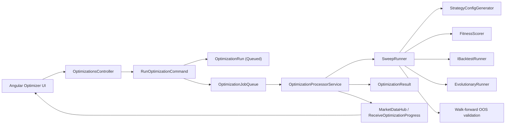

# Strategy Optimizer

The Strategy Optimizer is the platform's automated parameter-search system for signal-mode strategies. It generates candidate `StrategyConfig` variants, backtests them in bulk, ranks them by risk-adjusted performance, and optionally validates the strongest candidates on unseen out-of-sample data before the UI promotes a winner into the strategy builder.

## Overview

The optimizer is implemented as an asynchronous control-plane workflow:

1. The browser submits a `RunOptimizationRequest` to `POST /api/optimizations`.
2. `RunOptimizationCommand` persists an `OptimizationRun` in `Queued` state and enqueues an `OptimizationJob`.
3. `OptimizationProcessorService` dequeues the job and calls `ISweepRunner`.
4. `SweepRunner` generates candidate configs, runs in-sample backtests, optionally breeds evolutionary generations, and optionally runs out-of-sample validation.
5. The API persists `OptimizationResult` rows, updates the run status, and broadcasts progress through SignalR.

The current implementation optimizes signal-mode strategies only. `StrategyConfigGenerator` always emits `StrategyMode.Signal` configurations rather than grid-mode configs.

## Architecture

## Key Components

| Component | Location | Purpose |
|---|---|---|
| `RunOptimizationCommand` | `src/TradePilot.Application/Optimization/RunOptimizationCommand.cs` | Validates the request, creates a queued run, and enqueues work |
| `CancelOptimizationCommand` | `src/TradePilot.Application/Optimization/CancelOptimizationCommand.cs` | Cancels a queued or running optimization |
| `OptimizationJobQueue` | `src/TradePilot.Application/Optimization/OptimizationJobQueue.cs` | Channel-backed queue of optimization jobs |
| `OptimizationCancellationRegistry` | `src/TradePilot.Application/Optimization/OptimizationCancellationRegistry.cs` | Tracks per-run cancellation tokens |
| `OptimizationProcessorService` | `src/TradePilot.Api/Services/OptimizationProcessorService.cs` | Hosted service that processes queued jobs and persists results |
| `SweepRunner` | `src/TradePilot.Application/Optimization/Services/SweepRunner.cs` | Runs candidate generation, in-sample backtests, evolutionary generations, and OOS validation |
| `EvolutionaryRunner` | `src/TradePilot.Application/Optimization/Services/EvolutionaryRunner.cs` | Breeds offspring from elite strategies using crossover and mutation |
| `StrategyConfigGenerator` | `src/TradePilot.Application/Optimization/Services/StrategyConfigGenerator.cs` | Produces randomized signal-mode `StrategyConfig` candidates from parameter bounds |
| `FitnessScorer` | `src/TradePilot.Application/Optimization/Services/FitnessScorer.cs` | Applies qualification thresholds and computes ranking scores plus Sharpe/Sortino/ProfitFactor/Calmar metrics |
| `OptimizationsController` | `src/TradePilot.Api/Controllers/OptimizationsController.cs` | REST API for run, list, detail, and cancel operations |
| `OptimizerService` | `frontend/trading-ui/src/app/core/services/optimizer.service.ts` | Angular API client for optimization endpoints |
| `OptimizerPageComponent` | `frontend/trading-ui/src/app/features/optimizer/optimizer-page.component.ts` | Main optimizer page for submission, progress, results, and history |

## Run Lifecycle

### `OptimizationRun` Status Flow

| Status | Meaning |
|---|---|
| `Queued` | Request accepted and waiting in `OptimizationJobQueue` |
| `Running` | `OptimizationProcessorService` is executing the sweep |
| `Completed` | Results persisted successfully |
| `Failed` | The sweep failed with an error message |
| `Cancelled` | User cancellation or cancellation path completed |

### Processing Stages

| Stage | What happens |
|---|---|
| Candidate generation | `StrategyConfigGenerator.Generate(...)` creates random strategies from `ParameterBounds` |
| In-sample sweep | `SweepRunner` backtests each candidate over the in-sample date range |
| Qualification | `FitnessScorer.IsQualified(...)` filters results by minimum trades, win rate, and maximum drawdown percent |
| Evolutionary search | `EvolutionaryRunner.Breed(...)` produces offspring from top candidates when enabled |
| OOS validation | The top 25 in-sample strategies are replayed on the out-of-sample period when walk-forward is enabled |
| Persistence | `OptimizationProcessorService` writes `OptimizationResult` entities and marks the run complete |
| Broadcasting | Progress is sent through `ReceiveOptimizationProgress` on `MarketDataHub` |

## Candidate Generation

`StrategyConfigGenerator` builds candidates from `SweepConfig.Bounds`.

Current behavior:

- strategy mode is always `Signal`
- supported entry-condition templates are RSI, MACD, PriceVsEma, and combinations of those conditions
- directions and timeframes come from `ParameterBounds`
- risk config can be percent-wallet or risk-based sizing depending on `PositionSizeMode`
- exit config includes fixed take-profit plus either fixed-percent or ATR-initial stop loss
- trend filters are optional and only included when the bounds enable them

The generator names candidates `Optimizer-{n}` and also stores a human-readable `Description` that the UI shows as the result summary.

## Walk-Forward Validation

Walk-forward validation is driven by `WalkForwardConfig` inside `SweepConfig`.

When enabled:

- the requested date range is split into in-sample and out-of-sample periods using `ValidationSplitPercent`
- all candidates are scored on the in-sample period first
- the top 25 in-sample candidates are replayed on the out-of-sample period
- out-of-sample metrics are stored back into `OptimizationResult`

This is the main protection against ranking strategies solely on the data they were tuned against.

## Fitness Scoring

`FitnessScorer` uses two layers:

1. Qualification thresholds from `FitnessThresholds`
2. A composite ranking score from `Score(...)`

### Qualification Thresholds

| Threshold | Meaning |
|---|---|
| `MinTotalTrades` | Rejects strategies that do not generate enough sample trades |
| `MinWinRate` | Rejects strategies below the configured win-rate floor |
| `MaxDrawdownPercent` | Rejects strategies whose drawdown is too large relative to initial capital |

### Ranking Metrics

| Metric | Source |
|---|---|
| `FitnessScore` | Composite score combining risk-adjusted PnL, trade-count confidence, Sharpe, and profit-factor bonus/penalty |
| `SharpeRatio` | Computed from trade PnL dispersion |
| `SortinoRatio` | Computed using downside deviation only |
| `ProfitFactor` | Gross profit divided by gross loss |
| `CalmarRatio` | Total PnL divided by max drawdown |
| `TotalPnl` / `WinRate` / `MaxDrawdown` / `TotalTrades` | Persisted per result for UI sorting and review |

The code comments explicitly dampen metric bonuses when trade counts are small, so high Sharpe or profit factor on a tiny sample does not dominate ranking.

## Persistence Model

### `OptimizationRun`

`src/TradePilot.Domain/Entities/OptimizationRun.cs`

| Field Group | Notes |
|---|---|
| Identity | `Id`, `Symbol`, `CreatedAtUtc` |
| Date range | `StartDateUtc`, `EndDateUtc` |
| Config | `SweepConfigJson`, `ThresholdsJson` |
| Progress | `TotalCombinations`, `CompletedCount`, `QualifiedCount`, `FailedCount` |
| Status | `Status`, `ErrorMessage`, `ElapsedMs` |

Current-state note: the entity tracks the optimization run itself, not a source `StrategyId`. Generated candidates are stored as serialized strategy JSON per result.

### `OptimizationResult`

`src/TradePilot.Domain/Entities/OptimizationResult.cs`

| Field Group | Notes |
|---|---|
| Identity | `Id`, `OptimizationRunId`, `Rank` |
| Candidate | `StrategyConfigJson`, `SignalDescription` |
| In-sample metrics | `FitnessScore`, `TotalPnl`, `WinRate`, `MaxDrawdown`, `TotalTrades`, `WinningTrades`, `LosingTrades`, `TotalFeesPaid`, `AverageTradePnl`, `AverageHoldTimeMinutes` |
| Out-of-sample metrics | `OosTotalPnl`, `OosWinRate`, `OosMaxDrawdown`, `OosTotalTrades`, `OosFitnessScore` |
| Risk metrics | `SharpeRatio`, `SortinoRatio`, `ProfitFactor`, `CalmarRatio` |

## API Surface

`OptimizationsController` exposes these routes:

| Method | Route | Purpose |
|---|---|---|
| `POST` | `/api/optimizations` | Queue a new optimization run |
| `GET` | `/api/optimizations` | List paged optimization runs |
| `GET` | `/api/optimizations/{id}` | Get run details and persisted results |
| `POST` | `/api/optimizations/{id}/cancel` | Cancel a queued or running run |

`RunOptimizationRequest` accepts the date range, initial capital, sample size, parameter bounds, walk-forward settings, evolutionary settings, and qualification thresholds.

## Frontend Surface

The Angular route is `/optimizer`.

Key UI components:

| Component | Location | Purpose |
|---|---|---|
| `OptimizerPageComponent` | `frontend/trading-ui/src/app/features/optimizer/optimizer-page.component.ts` | Hosts the tabs for configuration, results, and history |
| `OptimizerConfigFormComponent` | `frontend/trading-ui/src/app/features/optimizer/optimizer-config-form/` | Builds the request payload and validates bounds |
| `OptimizerResultsTableComponent` | `frontend/trading-ui/src/app/features/optimizer/optimizer-results-table/` | Sortable list of ranked candidates including OOS columns when present |
| `OptimizerDetailComponent` | `frontend/trading-ui/src/app/features/optimizer/optimizer-detail/` | Detailed metric and config view for the selected result |
| `OptimizerHistoryListComponent` | `frontend/trading-ui/src/app/features/optimizer/optimizer-history-list/` | Run history with open, reuse, and cancel actions |

The UI also supports promoting a result into the strategy builder by parsing `strategyConfigJson` and navigating to `/strategies/new` with a prefilled config.

## Extending The Optimizer

When adding a new optimizer capability:

1. Extend `ParameterBounds`, `RunOptimizationRequest`, and the Angular form together.
2. Update `StrategyConfigGenerator` so generated configs can express the new parameter.
3. Confirm `IBacktestRunner` and shared strategy services support the new config shape.
4. Persist any new per-result metric in `OptimizationResult` and its response mapping.
5. Expose the new metric in the optimizer UI only after API and persistence are aligned.

## Related Knowledge

- `18-backtesting-architecture.md` for the replay engine the optimizer reuses
- `13-strategy-config-schema.md` for the config objects being generated
- `24-backtesting-grid-engine-explained.md` for the shared backtest execution path

## Future Recommendations

- Add true multi-objective ranking instead of a single composite score.
- Add Monte Carlo robustness testing on top-ranked candidates.
- Expand generation beyond the current signal-mode templates to include more strategy families.
- Add regime-aware optimization so candidates can adapt by market state instead of using one parameter set everywhere.
- Add portfolio-level optimization across multiple strategies or symbols once live multi-strategy orchestration exists.