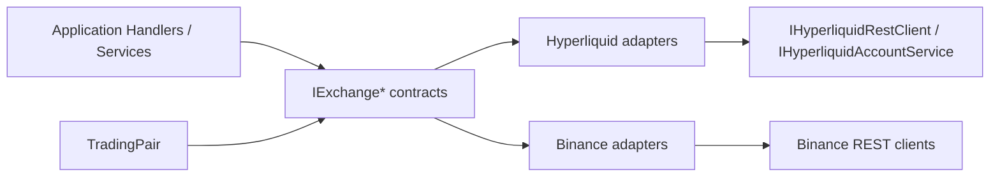

# Exchange Abstraction Architecture

The exchange abstraction layer introduces exchange-neutral contracts in the Application layer so the system can stay Hyperliquid-first today while making Binance and future venues much easier to add later. The goal is not to make every exchange identical. The goal is to isolate market metadata, account reads, historical data access, capability checks, and symbol translation behind stable seams so Application services stop depending directly on `IHyperliquid*` where that is unnecessary.

## Architecture Overview

The abstraction is organized around a canonical market model plus small capability-specific interfaces.

### Design Intent

- Keep execution and signing boundaries unchanged for now
- Move read-side consumers to exchange-neutral contracts first
- Preserve Hyperliquid runtime behavior while introducing seams
- Normalize market identity internally before exchange-specific mapping
- Defer runtime exchange selection and persistence-wide symbol migration to later phases

## Key Components

| Component | Location | Purpose |
|---|---|---|
| `TradingPair` | `src/TradePilot.Domain/ValueObjects/TradingPair.cs` | Canonical internal market identity (`BTC/USD:PERP`) |
| `Exchange` | `src/TradePilot.Domain/Enums/Exchange.cs` | Domain enum for venue selection |
| `AssetType` | `src/TradePilot.Domain/Enums/AssetType.cs` | Domain enum for `Perp` vs `Spot` |
| `IExchangeMarketMetadataProvider` | `src/TradePilot.Application/Abstractions/Services/IExchangeMarketMetadataProvider.cs` | Read-side market metadata seam |
| `IExchangeHistoricalDataClient` | `src/TradePilot.Application/Abstractions/Services/IExchangeHistoricalDataClient.cs` | Historical candles / funding-rate seam |
| `IExchangeAccountClient` | `src/TradePilot.Application/Abstractions/Services/IExchangeAccountClient.cs` | Account, fills, positions, and open-order seam |
| `IExchangeCapabilities` | `src/TradePilot.Application/Abstractions/Services/IExchangeCapabilities.cs` | Explicit feature support model per exchange |
| `IExchangeSymbolMapper` | `src/TradePilot.Application/Abstractions/Services/IExchangeSymbolMapper.cs` | Canonical `TradingPair` to native symbol mapping |
| `ExchangeCapabilitySet` | `src/TradePilot.Application/Abstractions/Services/ExchangeCapabilitySet.cs` | Immutable capability description record |

## Canonical Market Model

`TradingPair` is the internal representation used by the abstraction layer.

| Concern | Canonical Rule |
|---|---|
| Base asset | Uppercase base asset, e.g. `BTC` |
| Quote currency | Internally normalized to `USD` |
| Product type | Explicit `AssetType` (`Perp`, `Spot`) |
| Canonical format | `BASE/QUOTE:PRODUCT`, e.g. `BTC/USD:PERP` |

### Why this matters

- Hyperliquid uses bare coins such as `BTC`
- Binance futures uses native pair symbols such as `BTCUSDT`
- Application services should not need to understand both formats directly
- `IExchangeSymbolMapper` becomes the boundary where exchange-specific symbol conventions are handled

## Current Implementations

### Hyperliquid

| Contract | Implementation | Notes |
|---|---|---|
| `IExchangeMarketMetadataProvider` | `src/TradePilot.Infrastructure/Hyperliquid/HyperliquidMarketMetadataProvider.cs` | Wraps `IHyperliquidRestClient` market metadata calls |
| `IExchangeHistoricalDataClient` | `src/TradePilot.Infrastructure/Hyperliquid/HyperliquidHistoricalDataClient.cs` | Wraps Hyperliquid candle snapshot reads |
| `IExchangeAccountClient` | `src/TradePilot.Infrastructure/Hyperliquid/HyperliquidAccountAdapter.cs` | Wraps `IHyperliquidAccountService` |
| `IExchangeCapabilities` | `src/TradePilot.Infrastructure/Hyperliquid/HyperliquidCapabilities.cs` | Declares current Hyperliquid support surface |
| `IExchangeSymbolMapper` | `src/TradePilot.Infrastructure/Hyperliquid/HyperliquidExchangeSymbolMapper.cs` | DI-injectable adapter that delegates to the static `HyperliquidAssetMapper` utility class |

### Binance

| Contract | Implementation | Notes |
|---|---|---|
| `IExchangeSymbolMapper` | `src/TradePilot.Infrastructure/Binance/BinanceAssetMapper.cs` | Maps canonical perp pairs to Binance USD-M symbols |
| `IExchangeHistoricalDataClient` | Not yet implemented | Binance historical ingestion still exists separately |
| `IExchangeAccountClient` | Not yet implemented | No generic Binance account adapter yet |
| `IExchangeCapabilities` | Not yet implemented | Runtime capability model still Hyperliquid-first |

## Current Consumer Coverage

The abstraction is partially adopted. The important outcome is that several Application services no longer need direct `IHyperliquid*` dependencies for exchange-neutral reads.

| Consumer | Current dependency | Status |
|---|---|---|
| `LiveMarketContextBuilder` | `IExchangeMarketMetadataProvider` | Migrated |
| `StateRecoveryService` | `IExchangeAccountClient` | Migrated |
| `GetMarketInfoQueryHandler` | `IExchangeMarketMetadataProvider` + `IExchangeSymbolMapper` | Migrated |
| `GetCandlesQueryHandler` | `IExchangeHistoricalDataClient` + `IExchangeSymbolMapper` | Migrated |
| `GetHealthQueryHandler` | `IHyperliquidRestClient` | Intentionally still Hyperliquid-specific |

## Capability Model

`IExchangeCapabilities` is the explicit place to declare venue differences rather than scattering them as hidden `if` statements.

Current Hyperliquid capability shape:

| Capability | Hyperliquid |
|---|---|
| Supported product types | `Perp` |
| Supports leverage | Yes |
| Supports trigger orders | Yes |
| Supports reduce-only | Yes |
| Supports public trades stream | Yes |
| Supports user event stream | Yes |
| Supports per-user network routing | Yes |

## What This Makes Easier

Adding a new exchange is now mostly an Infrastructure and DI task instead of a cross-cutting Application refactor.

Before this abstraction:

- new exchanges required more direct `IHyperliquid*` replacements in Application code
- symbol translation logic leaked across handlers and services
- Hyperliquid-specific reads were coupled into otherwise generic flows

After this abstraction:

- Application services can ask for metadata, candles, account state, and symbol translation through generic contracts
- exchange-specific behavior is concentrated behind adapters
- capability checks have a single explicit home
- new exchanges can be added incrementally without rewriting every consumer first

## What Is Still Deferred

This abstraction does not finish multi-exchange support by itself.

| Deferred area | Why it is separate |
|---|---|
| Runtime exchange selection | Requires keyed DI / exchange resolution strategy |
| Binance account adapter | Not needed for the initial Hyperliquid-first seam |
| Binance metadata adapter | Can be added later without changing Application consumers |
| Generic execution abstraction beyond current `IExecutionEngine` use | Higher-risk and tied to live trading differences |
| Persistence-wide canonical symbol migration | Requires entity/storage migration and regression coverage |

## Creating Or Extending Exchange Support

Use this checklist when adding Binance or another venue.

1. Add or update the exchange’s `IExchangeSymbolMapper` implementation.
2. Implement `IExchangeMarketMetadataProvider` if Application consumers need market info or leverage metadata.
3. Implement `IExchangeHistoricalDataClient` if the venue will serve candles or funding-rate history through the abstraction.
4. Implement `IExchangeAccountClient` if recovery, account views, or position reads must work through the seam.
5. Implement `IExchangeCapabilities` to make venue constraints explicit.
6. Register the implementations in the host composition root.
7. Migrate only the consumers that are truly exchange-neutral; keep venue-specific orchestration explicit.
8. Add seam tests for mapping, capabilities, and adapter behavior.

## Related Knowledge

- `02-hyperliquid-integration.md`
- `23-binance-integration.md`
- `29-control-plane-agent-architecture.md`
- `30-worker-execution-pipeline.md`
- `10-architecture-decisions.md`