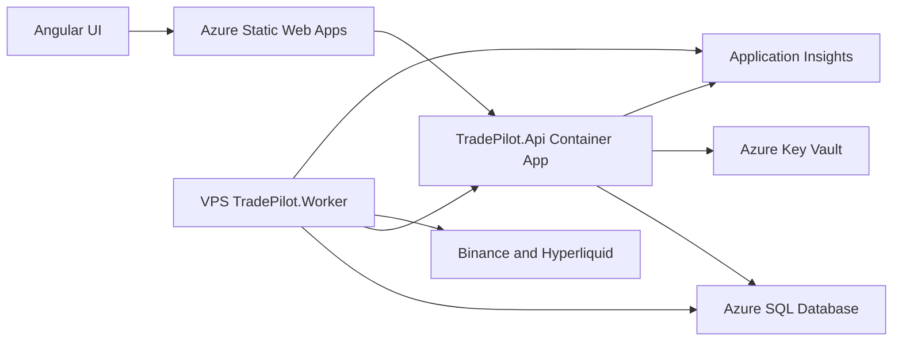

# Azure Deployment

TradePilot uses a split deployment model. Azure hosts the browser-facing control plane and shared services; `TradePilot.Worker` remains a Windows Service on the existing VPS and retains Hyperliquid signing material. Azure must never become the Worker runtime or the custodian of execution private keys.

## Architecture



The deployment uses the existing Azure resources for Azure SignalR and installer artifact storage because they support the current browser and agent-update behavior. It does not provision ACR, AKS, Redis, Service Bus, API Management, Front Door, or a Worker Container App.

## Azure Resources

`infrastructure/main.bicep` provisions the Azure-hosted platform.

| Resource | Purpose |
|---|---|
| Azure SQL Server and database | Shared relational persistence for API and Worker |
| Azure Key Vault | Production API secrets |
| User-assigned managed identity | Stable identity for API Key Vault and Azure SQL access |
| Container Apps Environment and `tradepilot-<env>-api` | `TradePilot.Api` only |
| Static Web App | Angular frontend |
| Log Analytics and Application Insights | API telemetry and shared logs |
| Azure SignalR | Browser real-time messaging |
| Storage Account | Execution-agent installer artifacts |

The `deployApi` Bicep parameter supports safe bootstrap. `false` creates shared infrastructure, Key Vault, and the API identity without creating/updating the Container App revision. `true` enables the API after Key Vault secrets exist.

## Identity And Secrets

The API uses the user-assigned identity created by `infrastructure/modules/managed-identity.bicep`.

| Consumer | Authentication model | Permissions |
|---|---|---|
| API -> Key Vault | Managed identity | `Key Vault Secrets User` only |
| API -> Azure SQL | Managed identity | Explicit Azure SQL contained user with API-required grants |
| VPS Worker -> Azure SQL | Separate Entra application/service principal | Explicit contained user with Worker-required grants |
| VPS Worker -> Key Vault | Not required by default | Keep execution credentials local on the VPS |

Key Vault secret names used by the API Container App are `jwt-secret-key`, `llm-api-key`, `signalr-connection-string`, and `installer-blob-connection`. Telegram remains optional and is not required for the API revision to start.

Hyperliquid private keys remain VPS-only values such as `Hyperliquid__PrivateKey`. They must not be placed in Key Vault for the API, Bicep, GitHub Actions parameters, browser configuration, or container images.

## Database

TradePilot uses SQL Server/Azure SQL only. `TradePilot.Persistence` configures `UseSqlServer` with transient failure retries. There is no SQLite runtime path.

Application startup does not apply migrations unless `Database__ApplyMigrations=true` is explicitly set. Production migrations are a controlled operational action, for example:

```powershell
dotnet ef database update --project src/TradePilot.Persistence --startup-project src/TradePilot.Api
```

Before enabling the API revision, configure an Entra administrator on the SQL Server and create contained database users for the API managed identity and Worker service principal. Grant least privilege and do not share the SQL administrator account with either host.

The Azure SQL template keeps the Azure-services firewall rule because Container Apps does not have a stable public egress IP in this low-cost topology. Set `workerPublicIpAddress` to the VPS fixed public address to add a dedicated Worker firewall rule. Private networking is deferred until justified.

## CI/CD

`.github/workflows/deploy.yml` validates pull requests and deploys pushes to `main` to `dev`; `workflow_dispatch` can select `dev` or `prod`.

Deployment flow:

1. Restore, build, test .NET; build and lint Angular; compile Bicep.
2. Publish `ghcr.io/mikeoconnor1980/tradepilot-api:sha-<commit>` with `GITHUB_TOKEN`.
3. Authenticate to Azure through GitHub OIDC.
4. Deploy Bicep with `deployApi=false`.
5. Write GitHub environment secrets and generated SignalR/storage connection strings to Key Vault.
6. Deploy Bicep with `deployApi=true` and the Static Web App origin.
7. Build Angular with the Container App HTTPS hostname, deploy Static Web Apps, and verify `/health/ready`.

The GHCR package must be public for Container Apps to pull it without a long-lived GitHub PAT. If it is made private later, introduce a scoped read-only package credential through Key Vault rather than embedding it in Bicep or workflow YAML.

### Required GitHub Environment Configuration

| Name | Type |
|---|---|
| `AZURE_CLIENT_ID`, `AZURE_TENANT_ID`, `AZURE_SUBSCRIPTION_ID` | OIDC federation configuration secrets |
| `SQL_ADMIN_LOGIN`, `SQL_ADMIN_PASSWORD` | Initial SQL server administration secrets |
| `JWT_SECRET_KEY`, `LLM_API_KEY` | Key Vault bootstrap secrets |
| `SWA_DEPLOYMENT_TOKEN` | Static Web Apps deployment secret |
| `VPS_WORKER_PUBLIC_IP` | Environment variable containing the fixed VPS IPv4 address |

The OIDC principal also needs permissions to deploy the resource group, write Key Vault secrets, retrieve SignalR/storage keys, and deploy Static Web Apps.

## Worker On The VPS

The Worker remains independently installed and released. The Azure workflow does not build, deploy, restart, or monitor the VPS service.

Required Worker settings are supplied through VPS environment configuration or another local secret mechanism, not committed JSON:

| Setting | Purpose |
|---|---|
| `ConnectionStrings__DefaultConnection` | Azure SQL connection using the Worker Entra identity |
| `Agent__ControlPlaneUrl` | HTTPS API Container App URL |
| `Hyperliquid__PrivateKey` | Local execution signing material |
| `ApplicationInsights__ConnectionString` | Optional, fail-open Worker telemetry |

Worker telemetry is optional: an unavailable Application Insights endpoint must not stop trading execution.

## Health And Observability

`TradePilot.Api` exposes:

| Endpoint | Meaning |
|---|---|
| `/health/live` | Process liveness without dependency checks |
| `/health/ready` | Readiness, including the EF Core database check |
| `/healthz` | Existing compatibility health endpoint |

Container Apps uses `/health/live` for liveness and `/health/ready` for readiness. API telemetry is configured through `ApplicationInsights__ConnectionString`; Worker telemetry uses the same setting when configured.

## Operating Rules

- Rotate any credential ever committed to source control before deployment.
- Do not enable live-money trading until SQL identity grants, VPS firewall allow-listing, secret rotation, and Worker health monitoring are verified.
- Keep API at one replica initially because backtest and optimization queues are in-process and not durable across scale-to-zero.
- Treat all Angular configuration as public; it may contain only public URLs and identifiers.

## Related Knowledge

- `00-project-overview.md`
- `02-hyperliquid-integration.md`
- `03-infrastructure-architecture.md`
- `20-business-model-options.md`
- `29-control-plane-agent-architecture.md`