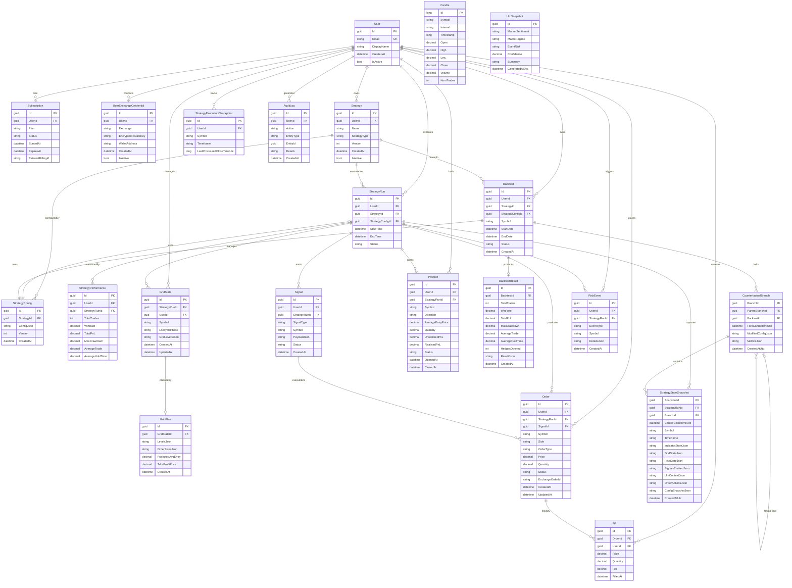

# 23 — Complete Data Model (Entity Relationship Diagram)

## Overview

This document defines the complete suggested data model for the AI Grid Trading Platform.
All trading entities are tenant-scoped by `UserId`. The model covers seven domains:

| Domain | Entities |
|---|---|
| Identity & Subscription | User, Subscription, UserExchangeCredential |
| Strategy | Strategy, StrategyConfig, StrategyRun, StrategyPerformance, StrategyExecutionCheckpoint |
| Trading | Order, Fill, Position, Signal |
| Grid | GridState, GridPlan |
| Market Data | Candle |
| AI Context | LlmSnapshot |
| Backtesting & Replay | Backtest, BacktestResult, StrategyStateSnapshot, CounterfactualBranch |
| Operations | RiskEvent, AuditLog |

---

## Entity Relationship Diagram

---

## Domain Details

### Identity & Subscription

**User** — Registered platform subscriber. Root entity for tenant scoping.

**Subscription** — Tracks billing plan and status. Trading is paused if subscription lapses.
- Plans: `Basic`, `Pro`
- Statuses: `Active`, `Paused`, `Cancelled`, `Expired`

**UserExchangeCredential** — Encrypted Hyperliquid wallet key per user. In Azure phase, maps to Key Vault secret.

---

### Strategy

**Strategy** — A named strategy instance owned by a user (e.g. "BTC Pullback Grid v2").
- StrategyTypes: `GridStrategy`, future: `TrendBreakoutStrategy`, `MeanReversionStrategy`

**StrategyConfig** — Versioned JSON configuration interpreted by the strategy plugin. Contains grid, trend, bias, entry, exit, hedge, and risk parameters.

**StrategyRun** — One runtime execution period for a strategy. Tracks start/end time and status.
- Statuses: `Running`, `Stopped`, `Error`

**StrategyPerformance** — Aggregated performance metrics for a completed strategy run.

**StrategyExecutionCheckpoint** — Prevents duplicate execution after restarts. Stores the last processed candle close time per user/symbol/timeframe.

---

### Trading

**Signal** — Strategy intent emitted by the StrategyEngine. Passes through RiskEngine before execution.
- Types: `DeployGrid`, `CancelGrid`, `TakeProfit`, `FlattenPosition`, `OpenHedge`, `AdjustHedge`, `CloseHedge`, `PauseStrategy`, `Cooldown`
- Statuses: `Generated`, `Validated`, `Approved`, `Executed`

**Order** — Exchange order placed via the ExecutionEngine. Links back to the originating Signal.
- Sides: `Buy`, `Sell`
- Types: `Limit`, `Market`
- Statuses: `Pending`, `Open`, `PartiallyFilled`, `Filled`, `Cancelled`

**Fill** — Individual fill event against an Order. Records price, quantity, and fee.

**Position** — Aggregated open or closed position. Tracks entry price, size, and P&L.
- Directions: `Long`, `Short`
- Statuses: `Open`, `Closed`

---

### Grid

**GridState** — Current lifecycle state for a grid deployment within a strategy run.
- Lifecycle phases: `Inactive`, `Planning`, `Deploying`, `Active`, `PartiallyFilled`, `FullyFilled`, `Closing`, `Closed`

**GridPlan** — Computed grid levels, order sizes, projected average entry, and take profit price. Created by GridPlanner when a valid setup is detected.

---

### Market Data

**Candle** — OHLCV candle data. Persisted via `ICandleRepository`. Used by live trading (sourced from Hyperliquid) and backtesting (queried by `HistoricalDataProvider`). Not tenant-scoped.
- `Interval` values: `15m`, `1H`, `4H`
- `Timestamp`: Unix milliseconds (open time of the candle)
- Composite unique index on `(Symbol, Interval, Timestamp)` — supports `INSERT OR IGNORE` idempotent ingestion

---

### AI Context

**LlmSnapshot** — Periodic LLM-generated market context cached for injection into MarketContext.
- MarketSentiment: `Bullish`, `Neutral`, `Bearish`
- MacroRegime: `RiskOn`, `Neutral`, `RiskOff`
- EventRisk: `Low`, `Medium`, `High`

---

### Backtesting & Replay Debugger

**Backtest** — A backtest run definition. Specifies strategy, config, symbol, and date range.
- Statuses: `Pending`, `Running`, `Completed`, `Failed`

**BacktestResult** — Performance output from a completed backtest.

**StrategyStateSnapshot** — Full engine state serialized at each candle close during a backtest or live run. Enables the step-through replay debugger (see doc 22).

**CounterfactualBranch** — A forked timeline with modified config, created during replay debugging. Self-referencing via `ParentBranchId` to support branching chains.

---

### Operations

**RiskEvent** — Records when the RiskEngine blocks, modifies, or flags a signal. Audit trail for risk decisions.
- Event types: `SignalBlocked`, `PositionSizeReduced`, `CooldownTriggered`, `DailyLossLimitHit`, `MaxLeverageExceeded`

**AuditLog** — General-purpose audit trail for platform actions (user logins, config changes, admin actions).

---

## Enum Reference

| Entity | Field | Values |
|---|---|---|
| Subscription | Plan | Basic, Pro |
| Subscription | Status | Active, Paused, Cancelled, Expired |
| Strategy | StrategyType | GridStrategy, TrendBreakoutStrategy, MeanReversionStrategy |
| StrategyRun | Status | Running, Stopped, Error |
| Signal | SignalType | DeployGrid, CancelGrid, TakeProfit, FlattenPosition, OpenHedge, AdjustHedge, CloseHedge, PauseStrategy, Cooldown |
| Signal | Status | Generated, Validated, Approved, Executed |
| Order | Side | Buy, Sell |
| Order | OrderType | Limit, Market |
| Order | Status | Pending, Open, PartiallyFilled, Filled, Cancelled |
| Position | Direction | Long, Short |
| Position | Status | Open, Closed |
| GridState | LifecyclePhase | Inactive, Planning, Deploying, Active, PartiallyFilled, FullyFilled, Closing, Closed |
| LlmSnapshot | MarketSentiment | Bullish, Neutral, Bearish |
| LlmSnapshot | MacroRegime | RiskOn, Neutral, RiskOff |
| LlmSnapshot | EventRisk | Low, Medium, High |
| Backtest | Status | Pending, Running, Completed, Failed |
| RiskEvent | EventType | SignalBlocked, PositionSizeReduced, CooldownTriggered, DailyLossLimitHit, MaxLeverageExceeded |

---

## Multi-Tenancy

All entities except `Candle` and `LlmSnapshot` are tenant-scoped by `UserId`.

Market data (Candle) and LLM context (LlmSnapshot) are shared resources — they are computed once and consumed by all active subscribers.

All database queries must filter by `UserId` to enforce data isolation.

---

## EF Core Mapping Notes

- All GUIDs are `Guid` type — generated application-side
- JSON columns (`ConfigJson`, `PayloadJson`, `GridLevelsJson`, etc.) use EF Core owned types or `HasColumnType("jsonb")` in PostgreSQL / `nvarchar(max)` in SQL Server
- `EncryptedPrivateKey` in `UserExchangeCredential` is encrypted at rest; in Azure phase stored in Key Vault
- Composite unique index on `StrategyExecutionCheckpoint` (UserId, Symbol, Timeframe) prevents duplicate execution
- Composite unique index on `Candle` (Symbol, Timeframe, OpenTime) prevents duplicate candle storage
