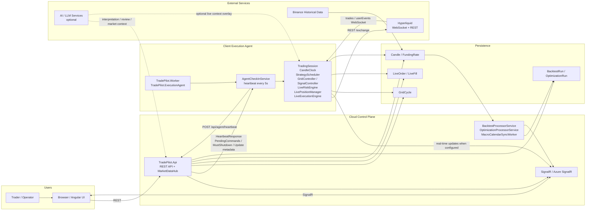

# TradePilot - High-Level Architecture

The deployed system is no longer a single bot host. It is a split architecture with an API control plane, a browser UI, and a client-side Windows execution agent that holds the private key and talks to Hyperliquid directly.

## Notes

- Browser traffic is split between REST calls to `TradePilot.Api` and SignalR subscriptions through `MarketDataHub` or Azure SignalR.
- Worker-to-API control is poll-based: the worker heartbeats every five seconds and receives queued commands in the heartbeat response.
- The worker, not the API, owns live exchange connectivity, order signing, and direct Hyperliquid order placement.
- Persistence names align to the current domain model: `GridCycle`, `LiveOrder`, `LiveFill`, `Candle`, `FundingRate`, `BacktestRun`, and `OptimizationRun`.
- AI integrations remain optional overlays rather than autonomous trade execution.

## Future Recommendations

- Add a companion deployment diagram that distinguishes local SignalR hosting from Azure SignalR publishing.
- Add a separate control-plane sequence diagram for agent update rollout and kill-switch flows.