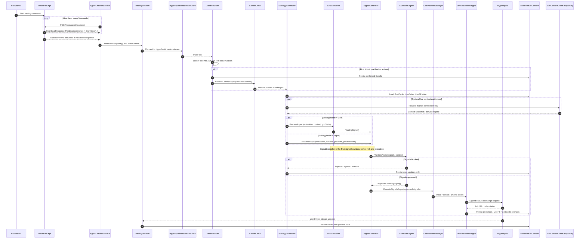

# TradePilot - Trading Cycle Sequence

This sequence reflects the current worker-driven live trading loop and the control path used by the API to start and stop that loop.

## Future Recommendations

- Add a companion sequence for agent update rollout through `UpdateCheckerService`.
- Add a separate failure-path diagram for reconnects, kill-switch shutdown, and command retry behavior.